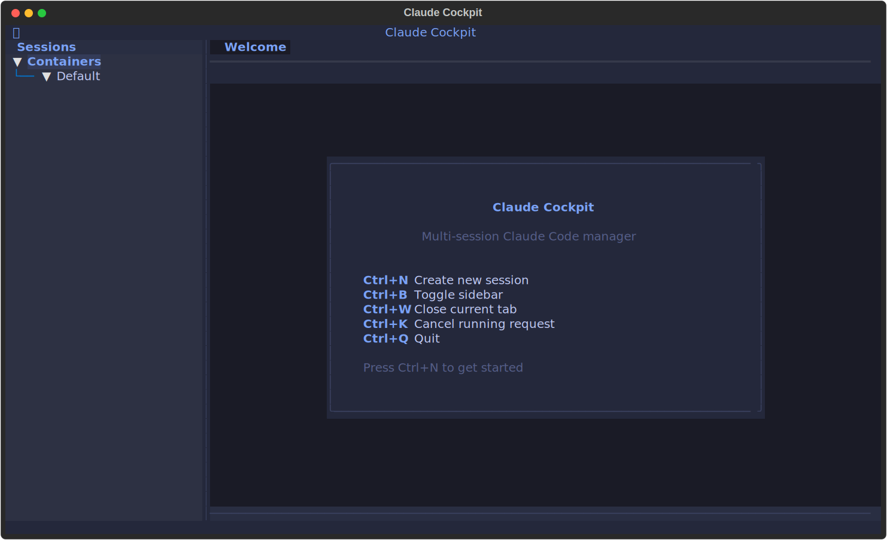

# Claude Cockpit

A multi-session terminal manager for [Claude Code](https://docs.anthropic.com/en/docs/claude-code). Run multiple Claude CLI sessions side-by-side in a tabbed, themed interface — either in your browser or as a native desktop app.



---

## What Is This?

Claude Cockpit lets you:

- Run **multiple Claude Code sessions** at once in tabs/split panes
- Organize sessions by **project folder** (workspace)
- Choose from **20 themes** (dark and light variants)
- **Drag and drop files** into sessions
- Resume previous Claude sessions
- Pick your Claude model (Sonnet, Opus, Haiku)

It works by wrapping the `claude` CLI in a web-based terminal emulator (xterm.js), managed through a FastAPI backend that handles the PTY (pseudo-terminal) connections.

---

## Prerequisites

Before you start, make sure you have these installed:

| Requirement | How to check | How to install |
|-------------|-------------|----------------|
| **Python 3.11+** | `python --version` | [python.org/downloads](https://www.python.org/downloads/) |
| **Node.js 18+** | `node --version` | [nodejs.org](https://nodejs.org/) |
| **Claude CLI** | `claude --version` | `npm install -g @anthropic-ai/claude-code` |

Claude CLI must be logged in and working. Run `claude` in your terminal first to make sure it works on its own.

---

## Quick Start (Development)

### 1. Clone the repo

```bash
git clone https://github.com/NovemberFalls/claude-cockpit.git
cd claude-cockpit
```

### 2. Install Python dependencies

```bash
pip install -r web/requirements.txt
```

> **Note:** You also need `pywinpty` on Windows:
> ```bash
> pip install pywinpty
> ```

### 3. Install frontend dependencies

```bash
cd web/frontend
npm install
cd ../..
```

### 4. Start the backend server

```bash
cd web
python server.py
```

This starts the API server on **http://localhost:8420**.

### 5. Start the frontend dev server (separate terminal)

```bash
cd web/frontend
npm run dev
```

This starts the Vite dev server on **http://localhost:5174**.

### 6. Open the app

Go to **http://localhost:5174** in your browser. You should see the cockpit interface. Click the **+** button in the sidebar to create your first Claude session.

---

## Using the Pre-Built Executables

If you don't want to set up a development environment, use one of the pre-built options.

### Option A: Browser-Based (simplest)

1. Download `claude-cockpit-browser.exe` from the `releases/` folder
2. Double-click it
3. Your browser will automatically open to **http://localhost:8420**
4. That's it — the server and frontend are bundled together

To stop: close the terminal window that appeared, or press `Ctrl+C`.

> **Tip:** You can suppress the auto-browser-open by setting the environment variable `NO_BROWSER=1`.

### Option B: Desktop App (native window)

1. Run `Claude Cockpit_0.1.0_x64-setup.exe` from the `releases/` folder
2. Follow the installer prompts (installs to your user folder, no admin needed)
3. Launch "Claude Cockpit" from your Start Menu or Desktop shortcut
4. The app opens in its own native window — no browser needed

The desktop app bundles the server internally and starts it automatically.

---

## Building the Executables Yourself

### Browser-Based exe

```bash
# 1. Build the React frontend
cd web/frontend
npm run build

# 2. Build the Python executable
cd ..
python -m PyInstaller --clean --noconfirm cockpit-server.spec
```

Output: `web/dist/claude-cockpit.exe` (~41 MB)

### Desktop App (Tauri)

Requires [Rust](https://rustup.rs/) to be installed.

```bash
# 1. Build the React frontend
cd web/frontend
npm run build

# 2. Build the PyInstaller sidecar
cd ..
python -m PyInstaller --clean --noconfirm cockpit-server.spec

# 3. Copy sidecar to Tauri binaries
cp dist/claude-cockpit.exe frontend/src-tauri/binaries/cockpit-server-x86_64-pc-windows-msvc.exe

# 4. Build the Tauri app
cd frontend
npx tauri build
```

Output: `web/frontend/src-tauri/target/release/bundle/nsis/Claude Cockpit_0.1.0_x64-setup.exe` (~42 MB)

---

## How to Use the App

### Creating a Session

1. Click the **+** button in the sidebar (or press `Ctrl+Shift+N`)
2. Pick a **working directory** — this is the project folder Claude will work in
3. Optionally give the session a name
4. Choose your model (Sonnet is the default)
5. Click **Create**

### Layouts

Use the layout buttons in the bottom status bar to switch between:

- **1x1** — single pane (full screen)
- **2x1** — two panes side by side
- **2x2** — four panes in a grid

Or use keyboard shortcuts: `Ctrl+Shift+!` (1x1), `Ctrl+Shift+@` (2x1), `Ctrl+Shift+$` (2x2).

### Sidebar

- **Active sessions** are grouped by their working directory
- **Locations** shows your saved project directories for quick access
- Click a session to focus it in a pane
- Right-click for options (new session in same folder, remove location)

### Themes

Click the palette icon in the top bar to cycle through 20 themes:

Tokyo Night, Nord, Dracula, Gruvbox, One Dark, Solarized, Synthwave, Monokai, Catppuccin, GitHub — each with dark and light variants.

### File Upload

Drag and drop files directly onto a terminal pane. Supported file types include code files, images, PDFs, JSON, CSV, and more (up to 50 MB each).

### Keyboard Shortcuts

| Shortcut | Action |
|----------|--------|
| `Ctrl+Shift+N` | New session |
| `Ctrl+Shift+B` | Toggle sidebar |
| `Ctrl+Shift+!` | 1x1 layout |
| `Ctrl+Shift+@` | 2x1 layout |
| `Ctrl+Shift+$` | 2x2 layout |

---

## Configuration

Copy `web/.env.example` to `web/.env` and edit as needed:

```env
# Server port (default 8420)
PORT=8420

# Bind address (default 0.0.0.0 = all interfaces)
HOST=0.0.0.0

# Google OAuth (optional — not needed for localhost)
GOOGLE_CLIENT_ID=your-client-id
GOOGLE_CLIENT_SECRET=your-client-secret
SECRET_KEY=some-random-string

# Restrict access to specific emails (optional)
ALLOWED_EMAILS=you@gmail.com,coworker@company.com
```

When running on `localhost`, authentication is automatically bypassed — no OAuth setup needed for personal use.

---

## Project Structure

```
claude-cockpit/
├── web/
│   ├── server.py          # FastAPI backend (REST + WebSocket)
│   ├── pty_manager.py     # PTY process manager (Windows ConPTY)
│   ├── auth.py            # Google OAuth (optional)
│   ├── requirements.txt   # Python dependencies
│   ├── cockpit-server.spec # PyInstaller build config
│   ├── static/            # Legacy frontend (fallback)
│   └── frontend/
│       ├── src/
│       │   ├── App.jsx              # Main app component
│       │   ├── components/
│       │   │   ├── TerminalPane.jsx  # xterm.js terminal
│       │   │   ├── Sidebar.jsx       # Session list
│       │   │   ├── TopBar.jsx        # Model selector
│       │   │   ├── StatusBar.jsx     # Layout controls
│       │   │   ├── NewSessionDialog.jsx
│       │   │   └── HexGrid.jsx       # Animated background
│       │   ├── themes/themeData.js   # 20 theme definitions
│       │   └── hooks/useTheme.jsx    # Theme provider
│       ├── src-tauri/               # Tauri desktop wrapper
│       ├── package.json
│       └── vite.config.js
├── src/cockpit/            # Legacy TUI (not actively used)
├── releases/               # Pre-built executables
├── pyproject.toml
└── README.md
```

---

## Deployment

### Environment Variables

| Variable | Default | Description |
|----------|---------|-------------|
| `SECRET_KEY` | `change-me-in-production` | Session cookie encryption key. **Must change for production.** |
| `GOOGLE_CLIENT_ID` | _(empty)_ | Google OAuth client ID (required for auth) |
| `GOOGLE_CLIENT_SECRET` | _(empty)_ | Google OAuth client secret |
| `ALLOWED_EMAILS` | _(empty)_ | Comma-separated emails/domains (empty = allow all) |
| `HOST` | `0.0.0.0` | Bind address |
| `PORT` | `8420` | Server port |
| `MAX_SESSIONS` | `8` | Maximum concurrent terminal sessions |
| `IDLE_TIMEOUT` | `7200` | Kill idle sessions after N seconds (0 = disabled) |
| `NO_BROWSER` | `0` | Set to `1` to suppress auto-opening browser |

### Running with Watchdog

For production, use the watchdog which auto-restarts on crash:

```bash
cd web
python watchdog.py
```

### Security Checklist

- [ ] Set a strong `SECRET_KEY` (e.g., `openssl rand -hex 32`)
- [ ] Configure `ALLOWED_EMAILS` to restrict access
- [ ] Use HTTPS via reverse proxy (nginx/Caddy)
- [ ] Set `NO_BROWSER=1` on headless servers

---

## Troubleshooting

### "claude CLI not found"

The app needs the `claude` CLI installed and in your system PATH.

```bash
npm install -g @anthropic-ai/claude-code
claude --version   # should print a version number
```

### Port 8420 already in use

Something else is using port 8420. Either stop it, or change the port:

```bash
PORT=9000 python server.py
```

### Terminal shows "[Session ended]"

The Claude process exited. This can happen if:
- Claude CLI isn't authenticated (run `claude` manually first)
- The working directory doesn't exist
- Claude crashed (check the terminal output for errors)

### WebSocket errors in the console

Transient `ECONNABORTED` or `ECONNRESET` errors in the Vite dev server console are normal during page reloads. They don't affect functionality.

### The exe won't start / antivirus blocks it

PyInstaller executables are sometimes flagged by antivirus software. You may need to add an exception for `claude-cockpit.exe` or `Claude Cockpit` in your antivirus settings.

---

## Tech Stack

| Layer | Technology |
|-------|-----------|
| Backend | Python, FastAPI, Uvicorn, pywinpty |
| Frontend | React 19, Vite 8, xterm.js, Tailwind CSS |
| Desktop | Tauri 2 (Rust + WebView2) |
| Packaging | PyInstaller (server exe), NSIS (installer) |

---

## License

Private project. All rights reserved.
